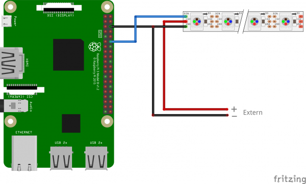

# Setup
This project uses five main tools:
1. [DotStar_emulator](https://github.com/chrisrossx/DotStar_Emulator) to simulate the led strip.
2. [AppInventor](http://appinventor.mit.edu/) for the android app.
3. [Firebase](https://console.firebase.google.com/) to allow communication between android and pc/raspberry.
4. [rpi-ws281x](https://github.com/rpi-ws281x/rpi-ws281x-python) to control the leds on the raspberry.
5. [audio-reactive-led-strip](https://github.com/scottlawsonbc/audio-reactive-led-strip) to control leds with music.

Since the _DotStar_emulator_ cannot be installed on the raspberry and the _rpi-ws281x_ does not work on pc, this two libraries are kept well separated.

In the following I will guide you to the installation and setup required to make everything work

## Python 3.7
The project works with python>=3.7, to set up your environment follow the steps:
- (Optional) source your environment, 
- Install the required modules:
    - On pc run `pip install -r requirements.txt `
    - On rpi run `sudo pip3 install -r requirements_pi.txt `

- To setup your custom patterns on pc you'll need to install [DotStar_emulator repo](https://github.com/nicofirst/DotStar_Emulator) on pc with:
```
python DotStar_Emulator/setup.py install
```
If you get a gcc error see [this](https://stackoverflow.com/questions/20023131/cannot-install-pyaudio-gcc-error).

### Audio reactive
To install the custom fork [audio-reactive-led-strip](https://github.com/nicofirst1/audio-reactive-led-strip) you'll need to 
follow the instructions in the [README](../audio-reactive-led-strip/README.md)
                       

## App Inventor
The MIT [AppInventor](http://appinventor.mit.edu/) is a tool to simply create apps with a building block programming paradigm. 
The first thing you'll need to do is make an account.
Then you can import the app from the [ledypie.aia](../AppInventor/ledypie.aia) file:
```
Click on 'Create Apps!'
Login
Click on 'My Projects' on the top left 
Import project (.aia) from my computer ...
And select the ledypie.aia file
```
Once imported you need to se the firebase URL and Token in 

```
Click on th "Designer" button on the top left
In the "Components" window scroll down unti you see  "FireBaseDB1" and click on it
Set both the "FirebaseToken" and "FirebaseURL"
```
Now you need to se the firebase url in the blocks too
```
Click on th "Blocks" button on the top left
Find the orange global initializer called "fire_base_url"
Set it to your url
```

You can check the [README](../AppInventor/README.md) in the AppInventor directory for a detailed explanation of the app.

### Firebase
The communication between the app and python works through the [Firebase](https://console.firebase.google.com/) database.

#### Database creation and linking 
To create a Firebase database and link it to the app use [this tutorial](https://rominirani.com/tutorial-mit-app-inventor-firebase-4be95051c325).
Be aware the FireBaseDB is already present in the app, so you don't need to instantiate a new one, simply fill out the _FirebaseToken_ and _FirebaseURL_ as described above.
#### Generating private key file
To connect the database with the python application you will need to generate a private key file as follows
```
In the Firebase console, open Settings > Service Accounts.

Click Generate New Private Key, then confirm by clicking Generate Key.
```
This will create a _privatekey.json_ file which will be used later.

## Raspberry 

### Diagram
Im currently using a _Raspberry Pi 4 Model B Rev 1.2_ with a [ws2812b led strip](https://www.amazon.com/CHINLY-Individually-Addressable-Waterproof-waterproof/dp/B01LSF4Q0A/ref=sr_1_7?dchild=1&keywords=ws2812b&qid=1593792574&sr=8-7) counting 300 leds on 5 meters.

Since the ws2812b draws 60mA for each led with 5V (check the [specs](https://cdn-shop.adafruit.com/datasheets/WS2812B.pdf)) I am powering the led strip using a [5v 100W power supply](https://www.amazon.com/BTF-LIGHTING-Aluminum-WS2812B-LED8806-Modules/dp/B01D8FLWGE/ref=sr_1_13?dchild=1&keywords=5v+20A+power+supply&qid=1593792785&sr=8-13) which should allow each pixel full brightness.

For the connection you can follow [this tutorial](https://tutorials-raspberrypi.com/connect-control-raspberry-pi-ws2812-rgb-led-strips/)  which uses following diagram:


Since there is no connection powering the RaspberryPi, an usb type c power supply is necessary.

### Starting script
Check the [script README](../scripts/README.md) to set learn how to start/stop the app with one script (useful when you want it to start on boot) and for syncing the pc repo with your rpi.

### Reactive Music
To work with the reactive music part use:
```shell script
sudo apt-get install python3-numpy python3-scipy python3-pyaudio
``` 
 
 As described in th [official repo](https://github.com/nicofirst1/audio-reactive-led-strip#installation-for-raspberry-pi)
